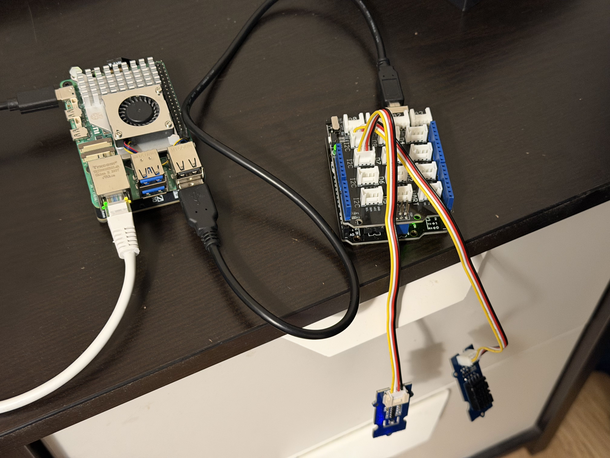
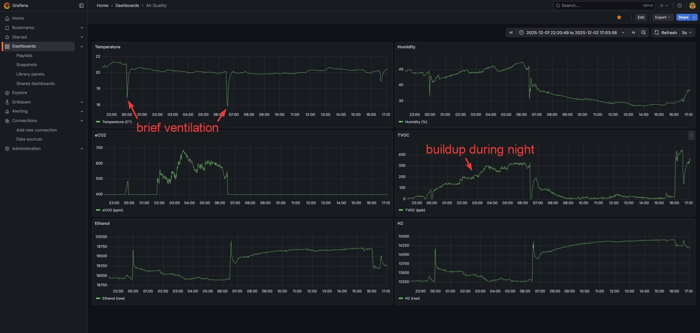

# Arduino-attached Sensors (Temperature/Humidity + TVOC/eCO2) + Prometheus + Grafana




## Introduction

This project reads sensor data from an Arduino over USB, exposes it via a simple Python exporter, and graphs it using Prometheus + Grafana.

It was intended for use with these sensors:

- [Grove - Temperature & Humidity Sensor V2.0](https://wiki.seeedstudio.com/Grove-Temperature-Humidity-Sensor-DH20/)
- [VOC and eCO2 Gas Sensor (SGP30) v1.1](https://wiki.seeedstudio.com/Grove-VOC_and_eCO2_Gas_Sensor-SGP30/)

And these other parts:

- Raspberry Pi (or other machine)
- [Arduino: ARD R3 DIP](https://joy-it.net/de/products/ARD_R3DIP)
- [Seeed Base Shield V2](https://wiki.seeedstudio.com/Base_Shield_V2/)

If your setup differs, you might need to make some adjustments.

## Setup

1. Connect sensors to any `I2C` ports on the Arduino shield. If you are not using shield, the connections you need to make are documented online, e.g. in some entries listed in [Sources](#sources).
1. Install and open [Arduino IDE](https://www.arduino.cc/en/software/)
1. Download ZIP of these libraries: [Adafruit\_SGP30](https://github.com/adafruit/Adafruit_SGP30), [Grove\_Temperature\_And\_Humidity\_Sensor](https://github.com/Seeed-Studio/Grove_Temperature_And_Humidity_Sensor) and import them in Arduino IDE (`Sketch -> Include Library -> Add .ZIP Library`)
1. Paste the contents of [arduino\_code.ino](arduino_code.ino) into the text editor, make sure right board/port is selected and press the upload button. (Test by checking the **Serial Monitor** with baud set to `115200`)
1. Connect the Arduino to your raspberry pi (or other desired machine)
1. Install [docker](https://docs.docker.com/engine/install/debian/) and [docker compose](https://docs.docker.com/compose/install/linux/#install-using-the-repository)
1. `docker compose up -d --build`
1. Open grafana webui (<http://localhost:3000>). username: `admin`, password: `admin`
1. `Connections -> Data sources -> Add new data source -> Prometheus -> Prometheus server URL = http://arduino_prometheus:9090, Scrape interval = 5s -> Save & test`
1. Create new dashboard, add panels for: `temperature_c`, `humidity_percent`, `sgp30_tvoc_ppb`, `sgp30_eco2_ppm`, `sgp30_raw_h2`, `sgp30_raw_ethanol` from data source `prometheus`

## Useful Snippets / Debugging

Test USB-connected Arduino's serial output:

```bash
stty -F /dev/ttyACM0 115200 raw -echo -echoe -echok
cat /dev/ttyACM0
```

## Sources

- <https://wiki.seeedstudio.com/Grove-VOC_and_eCO2_Gas_Sensor-SGP30/>
- <https://wiki.seeedstudio.com/Grove-Temperature-Humidity-Sensor-DH20/>
